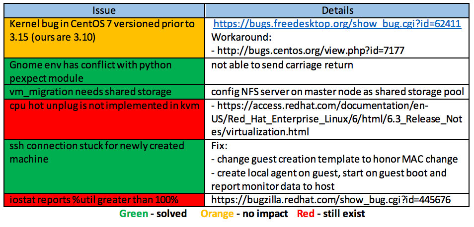

virtdc
=======================
[](https://drone.io/github.com/dcsolvere/virtdc/latest)

Statically place and schedule and dynamically scale and migrate Vitual Machines (VMs) to optimize resource utilization by using efficient VM algorithms while meeting the SLAs of users in cloud


##Virtdc Command Line Interface
Virtdc is a wrapper CLI for virtual machine placement and scaling which provides a way to create, manage and monitor 
virtual machines effectively. Virtdc framework enables user to create virtual machines, maintain information about guest 
and host, terminate virtual machine and to handle static virtual machine placement.

The following are the core functionalities of the virtdc CLI:
```
usage: virtdc [-h] [-v]
{create,terminate,list,dominfo,hostinfo,force-
migrate,removehost,loadbalanc e,consolidate,addhost,getip,monitorgraph}
```

##Commands
Option | Specification
------------ | -------------
create | create new domain from the base image
terminate | terminate running domain
list | list running domain
dominfo | domain information
hostinfo | host information
force-migrate | migrate domain from source host to dest host
removehost | remove the host
loadbalance | loadbalance host
consolidate | consolidate host
addhost | add new host
getip | get domain ip
monitorgraph | monitor domain usage through vmonere

##Problems encountered



##Project Contributors

* Dinesh Appavoo ([@DineshAppavoo](https://twitter.com/DineshAppavoo))
* Ryan Wang
* Rahul Nair
* Qinghao Dai
* Haan Mo Johng
